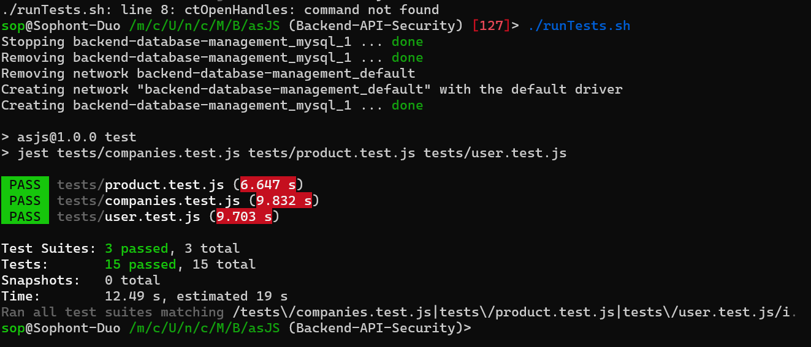

# Backend API Security

## Overview

This is a Node.js backend server for the StarShop, designed to provide secure endpoints via JWT and connect to the database.

## Table of Contents

- [Overview](#overview)
- [Requirements](#requirements)
- [Installation](#installation)
  - [1. Clone this repo](#1-clone-this-repo)
  - [2. Build the Docker image or run locally](#2-build-the-docker-image-or-run-locally)
    - [2.1 Docker](#21-docker)
    - [2.2 Local Installation](#22-local-installation)
- [API Endpoints](#api-endpoints)
- [Test Documentation](#test-documentation)
  - [Environment](#environment)
  - [Test Cases](#test-cases)

## Requirements

- **Node.js**: Version 20
- **Docker**: Required for containerized deployment

## Installation

### 1. Clone this repo

```sh
git clone https://gitlab.com/tbz_git_projects/m321-verteilte-systeme-programmieren/star-shop.git
```

### 2. Build the Docker image or run locally

#### 2.1 Docker

```sh
docker build -t starshop-api .

docker run -d -p 3000:3000 --name starshop-api starshop-api
```

#### 2.2 Local Installation

```sh
npm install

node server.js
```

## API Endpoints

For detailed information, view the file `api`.

## Test Documentation

### Environment

- **Node.js Version**: 20
- **Dependencies**: Jest for unit testing

### Test Cases

The following table outlines the unit test cases for User, Product, and Company handlers, covering core CRUD operations and key functionalities.

| Test Case           | Purpose                                                            | Input                                              | Expected Output                                                                                       |
|---------------------|--------------------------------------------------------------------|----------------------------------------------------|-------------------------------------------------------------------------------------------------------|
| **User Handlers**   |                                                                    |                                                    |                                                                                                       |
| Get One User        | Verify retrieval of a specific user by ID                          | User ID: 1                                         | `{ "id": 1, "username": "Admin", "email": "admin@starshop.ch", "role": "Admin" }`              |
| Create User         | Validate creation and storage of a new user                        | `{ "user": "admin2", "password": "1234", ...}`  | Created user data with ID 3, matching input values                                                    |
| Get Deleted User    | Confirm retrieval of a deleted user returns an empty result        | User ID: 3                                         | `[]`                                                                                                  |
| Get All Users       | Verify retrieval of all users                                      | None                                               | Array of users including `{ "id": 1, "username": "Admin", "email": "admin@starshop.ch", "role": "Admin" }` |
| Update One User     | Ensure updating user info modifies data as expected                | User ID: 1, `{ "username": "bro3" }`             | `{ "id": 1, "username": "bro3", "email": "admin@starshop.ch", "role": "Admin" }`             |
| **Product Handlers**|                                                                    |                                                    |                                                                                                       |
| Get All Products    | Verify retrieval of all products                                   | None                                               | Array of products including `{ "id": 1, "name": "Mouse", "price": 150 }`                          |
| Get One Product     | Validate retrieval of a specific product by ID                     | Product ID: 1                                      | `{ "id": 1, "name": "Mouse", "price": 150, "description": "USB office mouse" }`                |
| Create Product      | Ensure successful creation of a new product                        | `{ "name": "Headset", "price": 50, ... }`       | `{ "id": 3, "name": "Headset", "price": 50 }`                                                    |
| Update Product      | Verify updating a product modifies data as expected                | Product ID: 3, `{ "name": "X Pro Wireless" }`    | `{ "id": 3, "name": "X Pro Wireless" }`                                                            |
| Delete Product      | Confirm retrieval of a deleted product returns an empty result     | Product ID: 3                                      | `[]`                                                                                                  |
| **Company Handlers**|                                                                    |                                                    |                                                                                                       |
| Get One Company     | Validate retrieval of a company by ID, including associated products| Company ID: 1                                      | `{ "company_id": 1, "company_name": "Logitech", "products": [{ "name": "Mouse" }] }`            |
| Get All Companies   | Verify retrieval of all companies                                  | None                                               | Array of companies including `{ "company_id": 1, "company_name": "Logitech" }`                    |
| Create Company      | Ensure successful creation of a new company                        | `{ "name": "Razer" }`                            | `{ "company_id": 3, "company_name": "Razer" }`                                                    |
| Update Company      | Validate that updating a company’s information is handled correctly| Company ID: 3, `{ "name": "rocat" }`             | `{ "company_id": 3, "company_name": "rocat" }`                                                    |
| Delete Company      | Confirm retrieval of a deleted company returns an empty result     | Company ID: 3                                      | `[]`                                                                                                  |

Each test verifies core functionality and checks for expected behaviors, ensuring reliable operation across the system.

This documentation provides an overview of the unit tests and their expected outputs. Each test case is designed to ensure accurate functionality for CRUD operations across User, Product, and Company handlers.

### Test Protocoll
Ran the unit tests through the file [Tests](./runTests.sh)
Tests came back as
